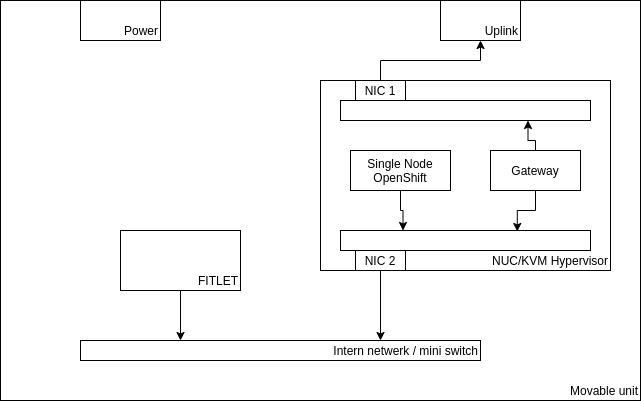

# Hardware Setup

## Provided Hardware

- NUC
- Fitlet

## Additional Hardware

- USB-C Ethernet Dongle
- Network Switch

## Setup

The NUC:
  - Router, masquerading all factory internal traffic
  - DHCP, DNS and tftp service
  - KVM Hypervisor, running 1 VM, the SNO

The complete solution can be seen as a black box, where the only two connections that need to be made are AC and Internet uplink.

